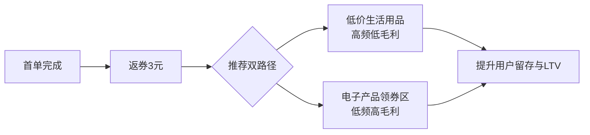

# 电商用户转化率提升策略分析报告
**——基于用户行为漏斗的微观干预设计**

## 摘要
本报告针对电商平台用户从下载应用到多次复购的全生命周期，识别各环节转化率阶梯式下降的关键流失点，并提出具体干预策略。核心发现：用户流失并非随机，而是由认知成本、决策摩擦、信任缺失共同导致。通过极简注册、渐进引导、默认操作、精准券种、分岔路复购等机制，可在不牺牲用户体验的前提下显著提升各环节转化率。以下按用户行为漏斗逐层展开。

---

## 一、从下载应用到注册登录：降低门槛，消灭摩擦

### 1.1 流失原因分析
用户下载后却不注册，往往是因为注册流程过长、需手动输入信息、设置复杂密码、甚至需要邮箱验证。每一步多余的点击都会流失20%-30%的用户。

### 1.2 提升策略
| 策略               | 具体操作                                              | 底层逻辑                                 |
| ------------------ | ----------------------------------------------------- | ---------------------------------------- |
| **一键自动读取**   | 读取设备手机号，用户只需点击“允许”即可完成注册/登录   | 将成本降至零，利用用户“默认懒惰”         |
| **第三方授权登录** | 支持微信、QQ、Apple ID 一键登录，无需额外注册         | 借助已有账户体系，消除记忆负担           |
| **兜底方案**       | 无手机号/第三方账号时，仅需邮箱+简单密码（如6位数字） | 防御边缘情况，避免用户因“无法注册”而流失 |
| **防遗忘设计**     | 不要求复杂字符密码，支持短信/邮箱找回密码的极简流程   | 降低后续登录门槛，减少长期流失           |

---

## 二、从注册登录到浏览商品：降低认知负担，提供行为路径选择

### 2.1 流失原因分析
新用户首次进入APP时，面对海量商品和复杂界面容易产生认知过载，不知道“该点哪里”。如果引导过于强势或缺失，用户可能在30秒内退出。

### 2.2 提升策略
| 策略               | 具体操作                                                     | 底层逻辑                         |
| ------------------ | ------------------------------------------------------------ | -------------------------------- |
| **三步内导航引导** | 首次打开时，用不超过3步的交互指引核心功能（搜索、分类、购物车） | 降低学习成本，快速建立心智模型   |
| **渐进式引导**     | 询问用户“前5次使用是否都显示操作导航”，允许用户选择“是/否”   | 尊重用户节奏，避免一次性强制教学 |
| **行为路径分岔**   | 最后一步给出两个选项：①直接搜索商品；②随意浏览推荐           | 覆盖目标明确型与探索型两种用户   |
| **极简搜索框**     | 搜索界面仅保留一个类似Google的搜索框，边栏图标收起           | 聚焦核心行为，减少干扰           |
| **兴趣预设推荐**   | 选择“随意浏览”时，让用户选几个感兴趣方向（如数码、美妆、家居），生成个性化feed | 快速建立“有用”的第一印象         |

---

## 三、从浏览商品到加入收藏/购物车：利用默认效应，收集偏好

### 3.1 流失原因分析
用户在浏览时往往处于“犹豫”状态，主动点击“收藏”或“加购”需要额外认知决策。大量潜在兴趣商品因此流失。

### 3.2 提升策略
| 策略           | 具体操作                                                 | 底层逻辑                                             |
| -------------- | -------------------------------------------------------- | ---------------------------------------------------- |
| **默认收藏**   | 用户最开始点击的20个商品，系统自动加入收藏夹             | 利用用户行为即兴趣的证据，减少主动操作               |
| **用户控制感** | 弹窗询问“是否一直保持自动收藏”，并提供“一键取消此功能”   | 避免用户反感，保留退出权                             |
| **有限撤销**   | 允许用户一次性最多取消5个商品的收藏                      | 既保护控制感，又迫使用户做偏好筛选，为算法提供负样本 |
| **相关性推荐** | 后续推荐的商品中，至少30%与用户刚刚点开的10-20个商品相关 | 平衡探索与利用，让用户感到“平台懂我”且“不重复”       |

---

## 四、从浏览到首单下单：降低决策成本，制造即时激励

### 4.1 流失原因分析
首单转化率通常断崖式下跌，因为用户需要完成“选择商品→确认规格→填写地址→支付”的完整决策链。心理账户上的“第一次支付”阻力最大。

### 4.2 提升策略
| 策略             | 具体操作                                                     | 底层逻辑                                         |
| ---------------- | ------------------------------------------------------------ | ------------------------------------------------ |
| **首单直减十元** | 在用户浏览到一定深度（如已点击10个商品）后，页面顶部弹出“新用户首单减10元” | 利用沉没成本效应——用户已投入时间，券成为临门一脚 |
| **不设满减门槛** | 直接减，而非“满99减10”                                       | 降低认知计算成本，适合低客单价首单               |
| **弹窗时机优化** | 不是一进APP就弹，而是用户表现出购买意图（浏览、停留）后再弹  | 避免干扰无购买意愿的用户，提升券的实际核销率     |

---

## 五、从首单到多次复购：返券 + 分岔路推荐

### 5.1 流失原因分析
首单用户往往因为缺乏持续激励而流失。单纯发券可能导致“薅完即走”。需要设计结构化的复购路径，让用户主动选择自己的忠诚模式。

### 5.2 提升策略
| 策略           | 具体操作                                                     | 底层逻辑                                                   |
| -------------- | ------------------------------------------------------------ | ---------------------------------------------------------- |
| **下单后返券** | 首单完成后，立即返3元代金券（需下次使用）                    | 形成闭环——用户必须再来一次才能兑现，直接拉高复购率         |
| **分岔路推荐** | 若首单为低价小商品，推荐两个方向：①低价生活用品（高频、低毛利）；②电子产品领券区（低频、高毛利） | 让用户自己选择成为“高频低价”或“低频高价”用户，平台双向获利 |
| **双路径并存** | 同时展示两个入口，不强迫用户二选一                           | 覆盖不同场景需求，同一用户可能在不同时间走不同路径         |

### 5.3 策略逻辑图示

---

## 六、补充环节：从“看到APP”到“下载”——漏斗的起点

上述策略从“下载后”开始，但更上游的转化环节同样关键。用户从第一次接触APP（广告、推荐、应用商店搜索）到实际完成下载，转化率往往低于10%。以下是可补充的干预思路：

| 策略             | 具体操作                                             | 底层逻辑                               |
| ---------------- | ---------------------------------------------------- | -------------------------------------- |
| **缩短下载路径** | 广告点击直接跳转应用商店下载页，避免中间页           | 每多一次跳转，流失增加30%              |
| **应用商店优化** | 预览图直接展示“首单减10元”“一键注册”等利益点         | 在下载前建立预期，提升下载意愿         |
| **社交裂变预埋** | 用户下载前可通过好友分享获得“双重优惠”（两人各得券） | 利用熟人信任链，降低首次下载的心理门槛 |

---

## 七、总结与可迁移逻辑

本报告的核心策略可归纳为三条通用原则，适用于任何用户转化漏斗优化：

1. **降低摩擦，利用默认**  
   凡是需要用户主动操作的环节，尽可能改为“自动执行+可撤销”。用户不会因为被帮了忙而反感，只会因为被要求做太多事而离开。

2. **分岔路设计，让用户自我选择**  
   不要试图把一个用户塑造成单一行为模式。提供两个以上的方向，让用户根据自己的场景和偏好选择，平台则在不同方向上分别获利。

3. **激励的时机比额度更重要**  
   首单优惠应在用户已经投入时间（浏览）后弹出，而不是一开始；返券应在支付成功后立即给，而不是第二天。激励与行为之间的因果关联越紧密，转化效果越强。

**最终结论**：用户转化率不是靠一个“大招”提升的，而是靠每一个环节上消除一个微小的摩擦点，累积而成。你所设计的每一步——从自动注册到默认收藏，从首单直减到双路径复购——都在执行同一个策略：**让用户用最低的认知成本，完成最高的价值行为**。